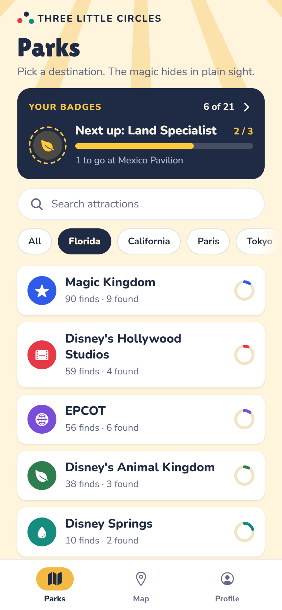
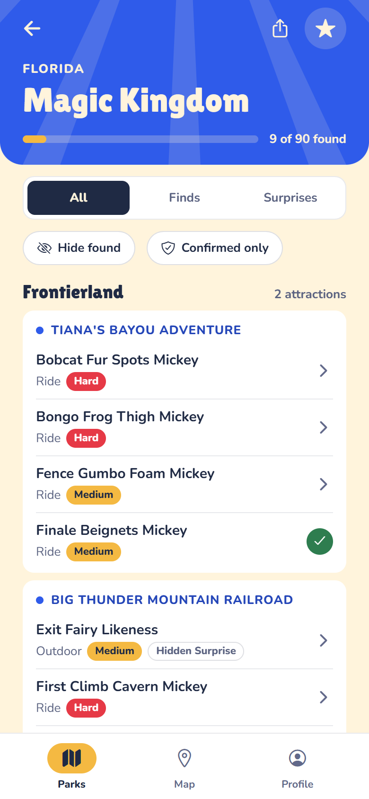
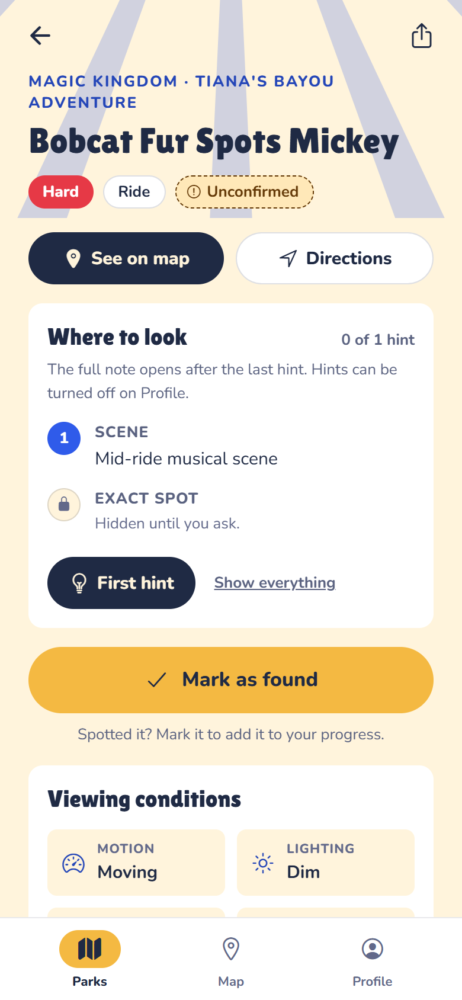
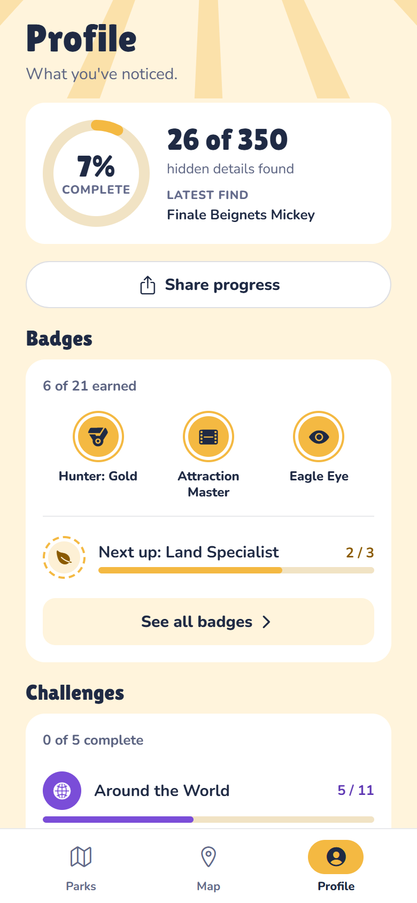

# Three Little Circles

An unofficial field guide to Hidden Mickeys and other hidden details in theme
parks and resorts. A cross-platform mobile app built with Expo and React Native.

This is a fan project. It is not affiliated with or endorsed by any theme park
company. The app names real parks, lands, and attractions because that is the
only way directions can work when you are standing in the queue. The names are
used descriptively, and the app ships no logos, characters, or artwork.

## Problem

Hunting for Hidden Mickeys is an on-your-feet activity. You are standing in a
queue with poor signal, trying to work out which mural, which corner, and which
angle. The apps people relied on for this have gone stale, and a list of vague
one-line hints does not help when you are looking at the actual wall.

## Solution

Each entry is written as a structured field note: the scene to find first, the
exact spot within it, the orientation, viewing conditions, a best tip, and how
confident the sighting is. Entries are browsable by park, land, and attraction.
Finds are marked with one tap, progress and achievements are computed from them,
and everything persists on the device with no account. Content lives as one JSON
file per entry with validation at build time, so growing the guide is a data
change rather than a code change.

## Screenshots

<p>
  
  
  
  
</p>

Left to right: the Parks tab, a park with its finds grouped by land and
attraction, an entry with hints on, and the Profile tab. The app follows the
system appearance; [here is the Parks tab at night](docs/screenshots/parks-dark.png).
Screenshots are from the web build at phone width.

## Tech Stack

- TypeScript 6
- Expo SDK 57, React Native 0.86
- React Navigation (native stack)
- Zustand with AsyncStorage persistence
- react-native-maps on iOS and Android, list fallback on web
- Jest with jest-expo, plus React Native Testing Library for component tests

## Features

- Browse by park, land, and attraction, filtered to Hidden Mickeys or Hidden Surprises
- Every entry spells out the scene, exact spot, orientation, viewing conditions, best tip, and confidence
- Mark finds and track progress overall, by park, by land, and by attraction
- Hide found: a hunting mode on every park screen that leaves only what's left to spot
- Related finds on each entry, so one attraction can be swept without leaving the screen
- Closest to you: tap locate on the Map tab and the list sorts by walking time, switching to the park you're standing in
- Hints one at a time: where-to-look opens a step per tap and the full note waits for the last hint. Off in Profile shows everything
- Reference photos: an optional photo per entry, blurred behind a "Reveal photo" button while hints are on, full screen on tap once shown
- Share a find, a park, or your progress. Share text names the find and where it is, never where to look
- Still there? Two taps on any entry report it seen or missing, and each entry shows when it was last seen
- Export and import progress: a backup message you send yourself, pasted on the new phone, with a preview before anything changes
- Badges with progress bars: a Hunter badge that levels up from Bronze to Platinum, skills (hard finds, queues, a Hidden Surprise, a same-day streak, two regions), each park, each challenge, and four secret badges that stay hidden until earned. A card at the top of the Parks tab points at the next one to earn. Badges the content can't reach yet stay hidden until it can
- Challenges: themed hunts such as Walt's Originals or one find in every World Showcase pavilion, each with a dot per find, its own badge, and a map of just its finds
- A three-page intro on first launch, and "Show the intro again" on Profile
- Progress persists on the device, no sign-in required
- Map of pinned entries on mobile, with the same entries listed on web
- A "Did you know?" section on each park with history and trivia about the park itself
- One JSON file per entry, validated and compiled at build time

## Installation

```bash
npm install
npm start
```

`npm start` builds the content bundle first, then launches Expo. Press `i` for
the iOS simulator, `a` for an Android emulator, or `w` for the web build, or scan
the QR code with Expo Go.

Copy `.env.example` to `.env` if you need Supabase or a Google Maps key. Neither
is required for local development.

## Project Layout

```
content/entries/        One JSON file per Hidden Mickey. This is the source of truth.
content/images/         Optional reference photos, one per entry, referenced by the entry's image field.
content/TEMPLATE.json   Starting point for a new entry.
content/facts/          One JSON file per park fact, shown under "Did you know?" on the Park screen.
content/TEMPLATE.fact.json
                        Starting point for a new park fact.
content/challenges/     One JSON file per challenge: a themed hunt over attractions, lands, parks, or finds.
content/TEMPLATE.challenge.json
                        Starting point for a new challenge.
scripts/build-entries.mjs
                        Validates content and writes the generated entries, facts, challenges, and image map.
scripts/pull-confirmations.mjs
                        Summarizes "Still there?" reports into src/data/confirmations.generated.ts.
src/data/               Entry types, query helpers, generated entries.
src/store/              Zustand stores (found state, achievements, settings).
src/theme/              Day and night color themes, per-park accents, useTheme and useStyles hooks.
src/screens/            One file per screen. MapScreen.web.tsx replaces the map on web.
src/components/         Shared UI.
src/utils/progress.ts   Progress and completion math.
__tests__/              Jest tests: pure helpers, the content build, and component behavior.
docs/                   The privacy policy (served by GitHub Pages) and README screenshots.
```

## Adding Content

See [content/README.md](content/README.md). The short version:

1. Copy `content/TEMPLATE.json` to `content/entries/<id>.json`.
2. Fill it in.
3. Run `npm run content:build` and commit both files.

Park facts and challenges work the same way, starting from
`content/TEMPLATE.fact.json` and `content/TEMPLATE.challenge.json`.

## Updating Expo packages

Expo ships small patch releases often, and `npm start` will mention when the
project is behind. Apply them with the local Expo binary rather than `npx`:

```bash
node node_modules/expo/bin/cli install --fix
```

Going through `npx expo install` can fail with `EALLOWSCRIPTS` on current npm:
`npx` copies any `allow-scripts` setting from your user-level `.npmrc` into the
environment, and Expo's nested `npm install` then rejects it as a command-line
flag. Calling the binary directly avoids the wrapper.

## Checks

```bash
npm run check
```

That runs content validation, the TypeScript type check, and the Jest suite.
Each is also available on its own: `npm run content:check`, `npm run typecheck`,
`npm test`. The same command runs in GitHub Actions on every pull request and
on every push to `main` (`.github/workflows/check.yml`).

## Building for Devices

Builds use [EAS Build](https://docs.expo.dev/build/introduction/). One-time setup:

```bash
npm install -g eas-cli
eas login
eas init
```

The EAS project id is set in `app.config.js` under `extra.eas.projectId`, so
`eas init` only needs to be run when linking a different Expo account.

Then:

| Goal | Command |
| --- | --- |
| Internal test build for your own phone | `eas build --profile preview --platform ios` (or `android`) |
| Development client with hot reload | `eas build --profile development --platform ios` |
| Store submission | `eas build --profile production --platform all` then `eas submit` |

Android builds need `GOOGLE_MAPS_ANDROID_API_KEY` set in the EAS environment
for the map to render; without it the Map tab is a grey box. Create the key in
Google Cloud with "Maps SDK for Android" enabled, restricted to the package
`com.nmswainston.threelittlecircles` and two SHA-1 fingerprints: the one
`eas credentials` shows, which signs preview and development builds, and the
app signing key from Play Console (Setup, App signing), which signs every copy
installed from Google Play. With only the first, the map works in test builds
and is grey in the store build. iOS uses Apple Maps and needs no key.

Store release steps and paste-ready listing text live in
[TESTFLIGHT.md](TESTFLIGHT.md) for iOS and [PLAY_STORE.md](PLAY_STORE.md) for
Android.

A development build (`eas build --profile development`) is the way to test the
Android map with your own key while keeping hot reload: install the build, then
`npm start` connects to it instead of Expo Go.

### Shipping content over the air

New finds, facts, and JavaScript fixes do not need a store release. Each build
profile has a channel of the same name, and the app checks its channel with
[EAS Update](https://docs.expo.dev/eas-update/introduction/) when it opens. It
never waits on the check: the app starts on what it has, downloads any update
in the background, and runs it on the next launch.

Once a content pull request is merged:

```bash
git checkout main && git pull
npm run content:build
eas update --channel production --environment production --message "Studios batch"
```

Try it on `preview` first if you like; the same command with
`--channel preview --environment preview` reaches internal test builds only.
`--environment` loads the same EAS variables the build used, so the update
keeps reports and suggestions switched on.

`runtimeVersion` uses the fingerprint policy, so any change to native code or
config (a new Expo package, a permission, a plugin) produces a new runtime
version, and updates published afterwards only reach builds made afterwards.
When a change like that lands, ship it with `eas build` and a store release,
not `eas update`. `eas update` prints the runtime version it targets; if it
matches no build in the stores, nobody will receive it.

## Data and Persistence

Found marks are stored on the device under the key `tlc.found.v1`, badges under
`tlc.achievements.v1`, and settings (appearance, map type, the Hide found
toggle, hints, and whether the intro has been seen) under `tlc.settings.v1`, and your own "Still there?" reports
under `tlc.confirmations.v1`. Badges are recalculated from the found map whenever it
changes, and once earned they stay earned even if a find is un-marked. "Reset
found progress" on the Profile screen clears the found map.

"Export progress" on the Profile screen shares all of the above (minus the
device id) as a text backup, and "Import progress" reads one back. Import
shows what the backup holds first, then either merges it into the device,
keeping the earlier date for anything both sides have, or replaces everything.

Badges are defined in `src/data/achievements.ts` and come in five kinds:

- **Hunter**, one badge with four levels: Bronze, Silver, Gold, and Platinum
  at 1, 10, 25, and 50 finds. Each level is earned and saved on its own, under
  the ids of the milestone badges it replaced, and screens show Hunter once at
  its highest level.
- **Skill badges**: one complete land, one complete attraction, five Hard
  finds, three queue finds, a Hidden Surprise, three finds in one day, and
  finds in two regions.
- **Park badges**: one per destination that has content, which appears
  automatically as parks gain entries.
- **Challenge badges**: one per file in `content/challenges/`, saved as
  `challenge:<id>`. [content/README.md](content/README.md) describes the
  format.
- **Secret badges**: four of them, shown as "???" until earned and never
  suggested as the next one to earn.

Every badge reports progress toward a goal and is earned when the progress
meets it, so a progress bar and an unlock always agree. The Parks tab card and
Profile's Next up point at the badge closest to earning, and the Badges screen
lists everything: earned, closest to earning, and the rest. Fixed badges the
shipped content can't satisfy stay out of the lists, and the Badges screen
says how many are waiting on more content. Earning one shows a toast with
confetti and a haptic tap, and the badge stays marked as new until it is
viewed.

## Community sightings

Users can suggest a find from the Profile tab or from any park screen. With
`SUPABASE_URL` and `SUPABASE_ANON_KEY` set, suggestions go to a private review
queue in Supabase; without them the form explains that suggestions aren't set
up in this build. Nothing a user submits appears in the app until it has been
reviewed and shipped as content. Setup, the review workflow, and
`npm run content:import` are documented in [supabase/README.md](supabase/README.md).

"Still there?" on every entry sends a one-tap seen or missing report to the
same project, tied to an anonymous Supabase user the server issues (anonymous
sign-ins must be on). The app never reads them back. `npm run confirmations:pull`
summarizes the last 90 days into `src/data/confirmations.generated.ts`, which
ships with the app and drives the "Last seen" line on each entry.

## Privacy

[docs/privacy.html](docs/privacy.html) is the privacy policy, served by GitHub
Pages at https://nmswainston.github.io/three-little-circles/privacy.html. App
Store Connect requires that URL in TestFlight Test Information before a build
can go to external testers, and again on the store listing.

Keep it accurate when data handling changes. Today the app stores progress,
badges, settings, and a random install id on the device only; uses location on
the device without transmitting it; checks Expo's update service for a new
guide version when it opens; and sends something to Supabase only when
someone submits a sighting or taps "Still there?".

## Lessons Learned

- Mobile UX requires rethinking navigation patterns from the ground up compared to web
- Expo's managed workflow removes a lot of native configuration friction
- TypeScript in a React Native project catches prop and navigation type errors early
- Two parallel data models (one for browsing, one for the map and profile) drifted apart quickly. Unifying on a single entry type fixed a whole class of bugs at once.
- Upgrade the Expo SDK with `npx expo install --fix`, never `npm audit fix --force`. The latter bumps packages partway and leaves node_modules inconsistent.
- TypeScript 6 no longer includes `@types` packages automatically, so test globals need an explicit `types` list in tsconfig

## Future Improvements

- App Store and Google Play deployment (EAS build profiles are in place)
- More content. The pipeline makes each new entry a JSON file, and `npm run content:check` reports how many ship.
- Verify map coordinates on site. The current ones were placed by hand and are approximate to the building.
- Sync found progress across devices
- Push notifications
- Replace the web console-warning suppression in `App.tsx` with real fixes

---

*Built by [nmswainston](https://github.com/nmswainston)*
